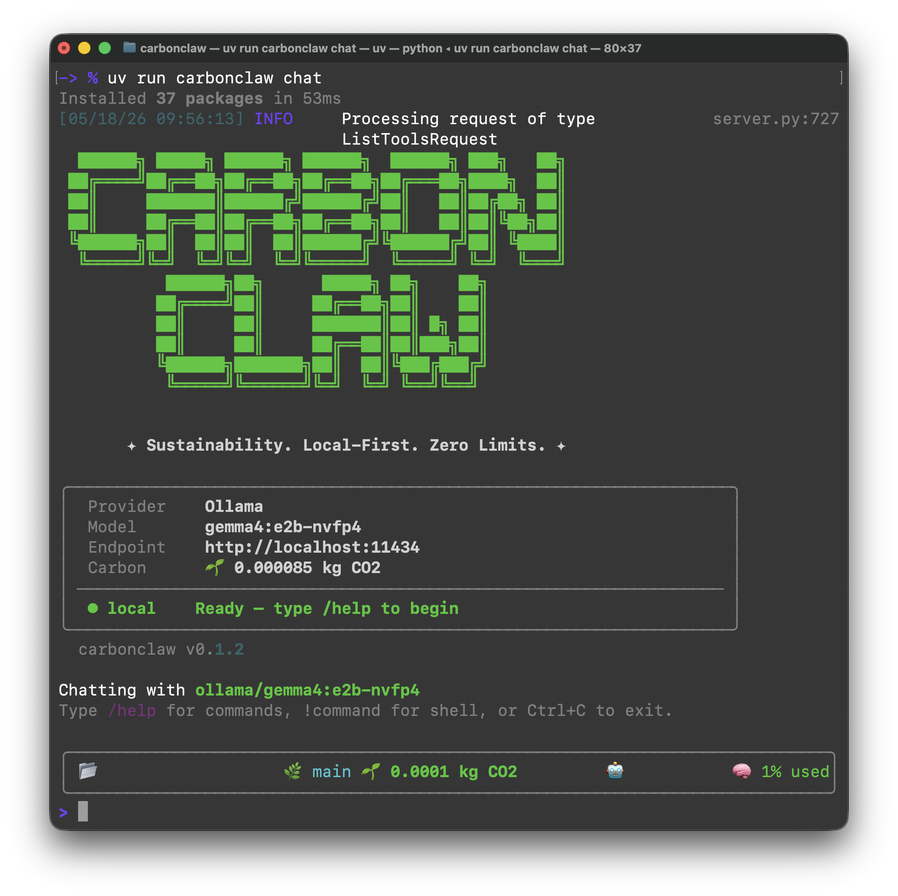

# CarbonClaw 🤖

CarbonClaw is a **Sustainability-Focused, Local-First, and Privacy-First** AI agent runtime for autonomous software engineering and self-evolving workflows.



## 🚀 One-Line Installation

```bash
curl -fsSL https://raw.githubusercontent.com/chakkritte/carbonclaw/main/install.sh | bash
```
*Requires Python 3.12+, Git, and uv.*

## 🌟 Key Features

- **Multi-Agent Orchestration**: Automated plan -> code -> test -> review -> docs workflows.
- **Self-Evolution**: Agents learn from interactions and autonomously improve their strategies.
- **Claude Code-Style Chat**: Interactive chat with multi-line input, draft preservation, and persistent chat renderer.
- **Browser Automation**: Full web interaction and scraping via Playwright.
- **Strictly Typed**: 100% Mypy compliance for enterprise reliability.
- **Observability**: Built-in OpenTelemetry tracing for monitoring execution paths and token costs.
- **Sustainability**: Real-time carbon emission tracking via `codecarbon` and proactive recommendations for local/greener models on simple tasks.
- **Advanced Research**: Multi-step Map-Reduce research pipeline for deep web analysis and comprehensive report generation.
- **Slide Generation**: Automated PowerPoint generation via `PptxGenJS` integration and specialized slide agents.
- **Smart Routing**: Autonomous model selection based on task type (Coding, Research, Slides) and complexity (inspired by OpenClaude).
- **Agent Overrides**: Pin specific agents (Planner, Coding, Review) to different models/providers for maximum efficiency.
- **Privacy First**: Built-in `/audit` command to scan conversation history for potential data leaks.
- **Advanced Web**: `/fetch` command for JS-rendered web scraping using a full browser engine.
- **Headless Mode**: Robust FastAPI server for remote agent execution and integration into other apps.
- **Human-in-the-Loop**: Mandatory approval gates for sensitive system operations, with colored diff previews and session-based **Auto-Accept**.

## 🛠 Quick Start

```bash
# Run the interactive setup wizard (Configure providers, keys, and persona)
carbonclaw setup

# Start an interactive chat
carbonclaw chat

# Run a one-shot engineering task
carbonclaw run "Refactor carbonclaw/core/base.py to use Protocol instead of ABC"
```

## 💬 Chat Features

The `carbonclaw chat` command provides a modern AI coding CLI experience:

| Feature | How to Use |
|---------|-----------|
| **Multi-line input** | End a line with `\` or type ` ``` ` to start a code block |
| **Draft preservation** | Press `Ctrl+C` while typing — draft is restored on next prompt |
| **History search** | `/history <query>` or native `Ctrl+R` |
| **Sustainability** | `/carbon` shows aggregated carbon emissions |
| **Smart Routing** | `/strategy <mode>` toggles routing (sustainability, latency, balanced) |
| **Provider Setup** | `/provider <name>` interactively switch LLM providers |
| **Advanced Fetch** | `/fetch <url>` renders JS-heavy pages via Playwright |
| **Deep Research** | `/research <query>` executes Map-Reduce analysis pipeline |
| **Privacy Audit** | `/audit` scans history for potential PII or secret leaks |
| **Open editor** | `/editor` opens `$EDITOR` to compose long messages |
| **Slash commands** | `/help`, `/clear`, `/undo`, `/redo`, `/mode`, `/compact`, `/export`, `/import` |
| **Shell escape** | `!command` runs shell commands and injects results into the conversation |
| **Approval gates** | Dangerous operations show colored diffs before asking `Proceed? [y/n]` |

## 📖 Documentation

For detailed guides, architecture, and advanced usage, see [CLAUDE.md](./CLAUDE.md).

## 📅 Roadmap

- [x] Multi-agent (Plan/Code/Review/QA/Docs)
- [x] Map-Reduce Research Pipeline & Slide Generation
- [x] Human-in-the-Loop & Self-Evolution
- [x] Browser Automation & OpenTelemetry
- [x] Carbon Emission Tracking & Green Recommendations
- [x] **Phase 1: Chat UX Foundation** (multi-line input, ChatRenderer, draft preservation, history search)
- [ ] **Phase 4: Event-Driven CI/CD Workflows**
- [ ] **Phase 5: Advanced Graph Memory**
- [ ] **Phase 6: IDE Integration (LSP)**

## License

MIT
